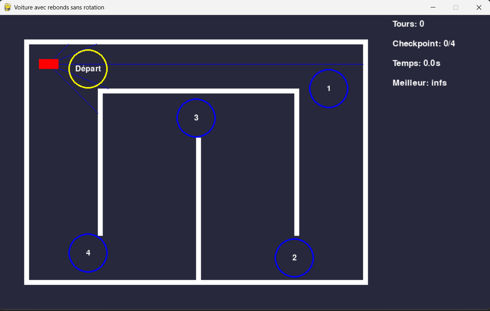

# 🚗 Driving Game


  
  

---

## 📝 Project Description 
This project is a **2D driving game** made with Pygame.  
You control a red car on a closed track, avoiding walls, passing checkpoints in order, and trying to beat your **best lap time**.  
Collisions with walls are handled with a **bounce effect** (the car is pushed back without rotating).  

This project helped me with []() and []() ! I just change the control ZQSD to control by my AI.

---

## ⚙️ Features
  🚗 Car movement with acceleration, braking, and turning  

  🧱 Walls and **bounce collisions**  

  🎯 Checkpoints with lap validation  

  ⏱ Lap timing with best lap record  

  👁️ Visual sensor rays (blue lines) detecting distances to walls  

---

## Controls
- **Z** → Accelerate  
- **S** → Brake / Reverse  
- **Q** → Turn left  
- **D** → Turn right  

---


## 🎮 Example Screenshots
Here is what the game looks like:



---

## ⚙️ How it works

  🕹️ The player drives a red car through a circuit defined by walls.  

  🧭 The car must pass checkpoints in order. Completing a lap updates the lap counter and times.  

  💥 When the car collides with a wall, it bounces back without rotation.  

  👁️ Blue rays are sensors showing distance to the nearest wall (useful for AI extension later).  

---

## 🗺️ Schema  
💡 Track layout and checkpoints are hardcoded in the code as rectangles and circles.  

You can easily **customize the circuit** by editing the `walls` and `checkpoints` lists in `main.py`.

---

## 📂 Repository structure  
```bash
├── img/
│   └── start.png
│
├── main.py
│
├── LICENSE
├── README.md
```

---

## 💻 Run it on Your PC  
Clone the repository and install dependencies:  
```bash
git clone https://github.com/Thibault-GAREL/driving_game.git
cd driving_game

python -m venv .venv # if you don't have a virtual environment
source .venv/bin/activate   # Linux / macOS
.venv\Scripts\activate      # Windows

pip install pygame

python main.py
```

---

## 📖 Inspiration / Sources
😆 100% coded by myself, no tutorials!
